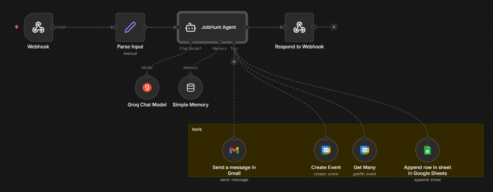

# 🎯 Autonomous AI Job Hunt Assistant

<p align="center">
  <em>A local, sovereign ReAct AI Agent designed to fully automate and manage your job hunting workflow — powered by n8n, Groq (Llama 3.3), and React.</em>
</p>

## ✨ Features

- **Autonomous Orchestration**: Uses the ReAct agent architecture to autonomously decide when to use tools vs. when to chat directly with the user.
- **Gmail Integration**: Drafts highly personalized, tailored cover letters and job application emails, maintaining the user in the loop with a "Draft First, Send Second" protocol. Automatically includes your Google Drive Resume link.
- **Calendar Management**: Automatically parses natural language to schedule interviews, track dates, and set up Google Calendar events.
- **Job Tracker Sync**: Pushes job application activities, dates, and company information directly to a Google Sheet database.
- **Memory Persistence**: Built with long-term simple memory so the agent contextually remembers your conversations and preferences across the session.
- **Sleek React Frontend**: A premium, dark-mode focused frontend built in Vite acting as your command center, allowing you to quickly view, approve, or reject email drafts.

## 🏗️ Architecture Stack

1. **Frontend**: React.js / Vite / Vanilla CSS (Glassmorphism layout)
2. **Orchestration**: Self-hosted **n8n** (Docker)
3. **Intelligence**: **Groq API** (Llama 3.3 70B model)
4. **Tools**: Google Cloud Platform APIs (OAuth2 for Gmail, Calendar, Sheets)

---

## 📸 Workflow Preview

Here is the underlying n8n ReAct Agent configuration that powers the autonomous workflow:



---

## 🚀 Getting Started

To run this project securely on your local system, you need to set up the n8n backend docker container and the React frontend.

### Prerequisites
- [Docker & Docker Compose](https://www.docker.com/)
- [Node.js (v18+)](https://nodejs.org/en/)
- A Google Cloud Project with the Gmail, Sheets, and Calendar APIs enabled (OAuth2).
- A free [Groq API Key](https://console.groq.com/keys)

### Step 1: Clone the Repository
```bash
git clone https://github.com/Viv-19/n8n-autonomous-ai-job-hunt-assistant-.git
cd n8n-autonomous-ai-job-hunt-assistant-
```

### Step 2: Configure Environment Variables
Inside the `n8n-docker` folder, create a `.env` file based on the template:
```bash
cd n8n-docker
cp .env.example .env
```
Fill in your `.env` with the following variables:
- `GROQ_API_KEY`: Your Groq API key (to run Llama 3.3 70B for free)
- `N8N_ENCRYPTION_KEY`: Run `openssl rand -hex 16` to generate this
- `RESUME_FILE_ID`: Find this in the URL of your Google Drive resume link (e.g. `1QYL3zKgU7CF...`)
- `SPREADSHEET_ID`: Find this in the URL of your Google Tracker sheet

### Step 3: Launch the n8n Orchestrator
```bash
docker-compose up -d
```
Head to `http://localhost:5678` to access your n8n dashboard.
To build the workflow from scratch or import, refer to the extremely detailed [MANUAL_WORKFLOW_BUILD_GUIDE.md](n8n-docker/workflows/MANUAL_WORKFLOW_BUILD_GUIDE.md) located in `./n8n-docker/workflows/`. Make sure to configure the AI Agent tools precisely!

### Step 4: Run the React UI Command Center
```bash
# Open a new terminal from the root folder
cd ai-job-hunt-ui
npm install
npm run dev
```
Open `http://localhost:5173` in your browser. You can immediately start chatting with the agent!

## 🧩 Usage Protocols

When asking the agent to send an email, it enforces a strict **"Draft-First"** protocol.
1. The AI Agent will respond with a visually rendered draft in the chat.
2. The agent connects back to the Gmail tool ONLY when you type an explicit confirmation (e.g. "Looks good, send it!").
3. The React hook `useChat` listens for "sent" / "delivered" from the LLM to successfully clear the Pending Draft UI element payload.

---
*Built as a personal AI agent orchestration project.*
